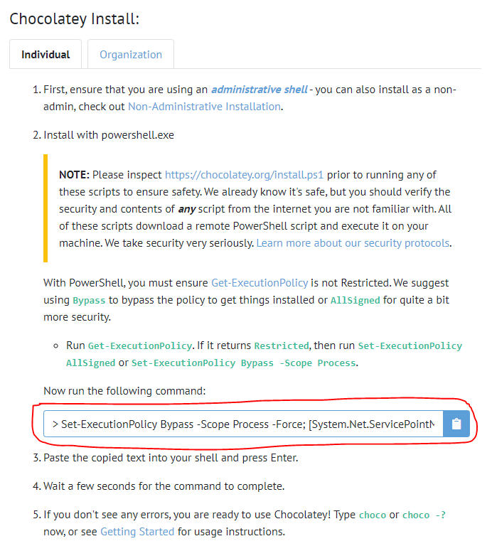
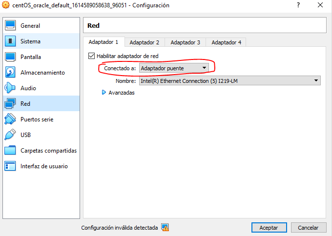
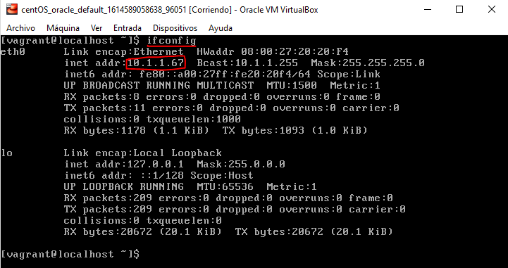
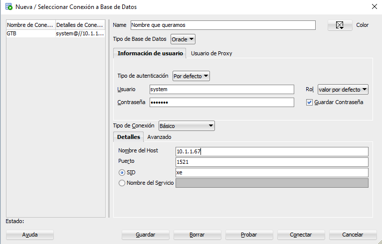

# Instalación optimizada de Oracle Database 11g

## Video de instalación

[](https://youtu.be/7h0cx0Qk_Bo)

## Instalación de Vagrant

1. Primero debe instalar la herramienta de **Vagrant** del siguiente [enlace](https://www.vagrantup.com/). También es posible mediante la herramienta [chocolatey](https://chocolatey.org/), para la cual deberá ejecutar el siguiente comando en PowerShell en modo administrador, que encontraremos en el siguiente [enlace](https://chocolatey.org/install).

	 

2. Tras ejecutar el comando de instalación desde powershell como administrador, chocolatey estará instalado. Una vez hecho esto podremos instalar vagrant con el siguiente comando, también desde powershell:

    ```powershell
    choco install -y Vagrant
    ```

## Descargar la máquina virtual ya configurada

Una vez instalado Vagrant, nos moveremos a un cmd y nos situaremos en la ruta donde queramos que se guarden las máquinas virtuales. Ahí, creará una carpeta con el nombre que quiera, donde instalará la máquina virtual. Muévase dentro una vez creada y ejecute los siguientes comandos desde el cmd:

```powershell
vagrant init neko-neko/centos6-oracle-11g-XE
vagrant up
```

Esta es una distribución de Linux sin interfaz gráfica (podemos instalarla sin), la cual viene con el **Oracle Developer 11g**. Una vez haya terminado la descarga, la máquina estará abierta en VirtualBox. Debemos iniciarla y entrar con la siguientes credenciales:

- Usuario: `vagrant`
- Contraseña: `vagrant`

## Configuración de la máquina virtual

1. Una vez dentro debemos apagar la máquina para aplicar un cambio. Esto lo haremos mediante el siguiente comando:

    ```bash
    sudo shutdown -h now
    ```

2. Una vez hecho esto iremos a la configuración de la máquina virtual en VirtualBox y la configuraremos en adaptador puente.

	 

3. Tras esto iniciaremos la máquina y entraremos nuevamente con las mismas credenciales y ejecutaremos el siguiente comando:

    ```bash
    ifconfig
    ```

    Este comando (lo subrayado) nos devolverá la ip (lo redondeado) de nuestra máquina virtual, necesaria para hacer la conexión.

     

> **NOTA:** Si a la hora de hacer la conexión, esta no funciona, pruebe a reiniciar la máquina y volver a ejecutar el comando ifconfig para verificar si la dirección ip ha cambiado.

## Instalación de SQL Developer

1. Tras esto, deberemos instalar el **SQL Developer**. Para ello accederemos al siguiente [enlace](https://www.oracle.com/tools/downloads/sqldev-downloads.html). Una vez seleccionamos la descarga para nuestro sistema operativo, nos pedirá que iniciemos sesión con una **cuenta de Oracle**. Debemos realizar este paso y en caso de no tener una, crearla. Los pasos son muy sencillos siguiendo el formulario y tras rellenarlo habrá que hacer una verificación por correo. Una vez hecho esto, podremos descargar el instalador.

2. Una vez descargado e instalado, podemos acceder al gestor de bases de datos desde la máquina anfitriona. Es desde aquí donde haremos la conexión

**Necesitaremos las siguientes credenciales:**

- Nombre de la máquina: `El que queramos darle`
- Usuario: `system`
- Contraseña: `vagrant`

 

> :warning: Es recomendable marcar la pestaña de “Guardar Contraseña”

Una vez hecho esto, hemos finalizado el proceso y podremos utilizar libremente el gestor. De esta manera podremos utilizar toda le gestión desde el equipo original, mientras que tanto la carga de los archivos y las bases de datos se están almacenando y ejecutando en la máquina virtual. Al ser esta mucho más ligera, la carga total del equipo es muchísimo menor y debería ir más fluido, el consumo total de RAM para la base de datos es de 2 GB y el Developer en la real, por su parte, es un servicio ligero, pues todo el cálculo se hace en la virtual.

## Créditos

- [Omar Domínguez Fuentes](https://github.com/Omardf00) 