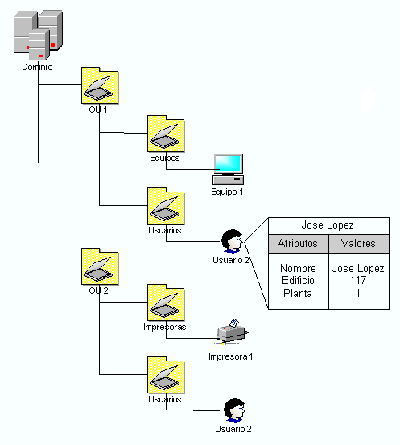
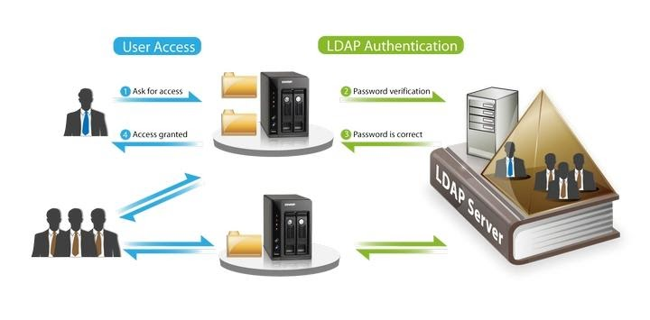
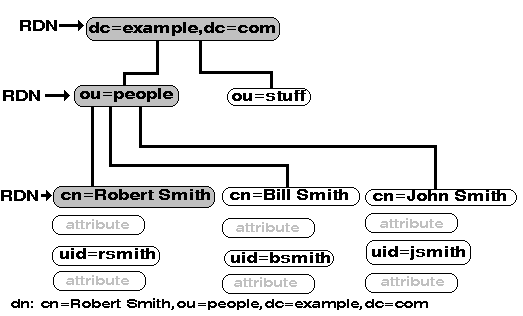

# ¿Qué es un servicio de directorio?

Wikipedia: “Un **servicio de directorio (SD)** es una aplicación o un conjunto de aplicaciones que almacena y organiza la información sobre los usuarios de una red de ordenadores y sobre los recursos de red que permite a los administradores gestionar el acceso de usuarios a los recursos sobre dicha red.”

Por tanto, un directorio es un conjunto de objetos con atributos organizados en una manera lógica y jerárquica (como un árbol). Esta estructura de datos en forma de árbol se denomina **DIT (Directory Information Tree)**.

Los objetos del servicio de directorio pueden pertenecer a una o más clases (objectClass). Los “objectClass” proveen a los objetos con una serie de atributos. Estos atributos pueden ser obligatorios u opcionales. Todos los “objectClass” disponibles en nuestro directorio se encuentran en el esquema o catálogo del directorio (“Schema” o “Global Catalog”), donde se guardan las definiciones de las clases y los atributos de cada una.

Algunos ejemplos de “objectClass”:

| Clase (objectClass)  | Extiende (superClass) |
| -------------------- | --------------------- |
| person               | top                   |
|                      |                       |
| organizationalPerson | person                |
| inetOrgPerson        | organizationalPerson  |
| organizationalUnit   | top                   |
| ...                  | ...                   |

| **Atributos (attribute)**  | **Descripción**                   | **Obligatorio** |
| -------------------------- | --------------------------------- | --------------- |
| cn, commonName             | Nombre común.                     | X               |
| sn, surname                | Apellidos.                        | X               |
| description                | Descripción.                      |                 |
| telephoneNumber            | Número de teléfono.               |                 |
| userPassword               | Contraseña de usuario.            |                 |
| description                | Descripción.                      |                 |
| l, localityName            | Localidad.                        |                 |
| postalAddress              | Dirección postal.                 |                 |
| postalCode                 | Código postal.                    |                 |
| st, stateOrProvinceName    | Provincia.                        |                 |
| street, streetAddress      | Calle.                            |                 |
| jpegPhoto                  | Foto en formato JPEG.             |                 |
| mail                       | Dirección de correo.              |                 |
| mobile                     | Número de móvil.                  |                 |
| ou, organizationalUnitName | Nombre de la unidad organizativa. | X               |
| description                | Descripción.                      |                 |
| l, localityName            | Localidad.                        |                 |
| postalAddress              | Dirección postal.                 |                 |
| postalCode                 | Código postal.                    |                 |
| st, stateOrProvinceName    | Provincia.                        |                 |
| street, streetAddress      | Calle.                            |                 |
| ...                        | ...                               |                 |

# ¿Qué es LDAP?

LDAP son las siglas de **Lightweight Directory Access Protocol** (Protocolo Ligero de Acceso a Directorios) que se refieren a un protocolo que permite el acceso a un servicio de directorio para buscar o actualizar información diversa en un entorno de red. 

# ¿Qué es un servidor LDAP?

Un **servidor LDAP** (también denominado DSA, Directory Service Agent) es un servidor de datos optimizado para la realización rápida de consultas de lectura y **orientado al almacenamiento de datos de usuarios** (u otros recursos de la red) a modo de directorio. La información se almacena en el directorio de forma jerárquica (como un árbol) como ya vimos antes.

La principal utilidad de un directorio LDAP es como **servidor de autentificación** para los distintos servicios de un sistema informático como puedan ser: autentificación para entrar en un PC, para entrar en una aplicación Web, para acceder a un servidor FTP, para acceder a servidores de correo entrante POP3 y saliente SMTP, etc.

Si en nuestra red disponemos de un servidor LDAP y configuramos todos los PCs y todos los servicios de la red para que se autentiquen en él, bastará con crear las cuentas de usuario y grupos de usuarios en nuestro servidor LDAP para que los usuarios puedan hacer uso del sistema y de sus servicios desde cualquier puesto de la red. Es un sistema ideal para **centralizar la administración de usuarios** en un único lugar.

El **Directorio Activo** de Windows y **OpenLDAP** son ejemplos de servidores de directorio.

# Terminología

- **Attribute:** Los atributos son las propiedades de los objetos (entries) del directorio. Tienen un nombre y un valor.

- **Auxiliary Object Class:** Es una clase de objeto (objectClass) que puede usarse para indicar que un objeto (entry) tiene una cualidad o característica. Cada objeto puede pertenecer a cero o más clases de objeto auxiliares.

- **DIT (Directory Information Tree)**: hace referencia a información de un directorio almacenada en forma de árbol. El árbol está formado por objetos, estos objetos pueden a su vez contener otros objetos, y uno de estos objetos debe servidor como raíz del árbol. Estos objetos pueden ser unidades organizativas, usuarios, impresoras, equipos, grupos,…

- **DN (Distinguished Name)**: nombre que identifica de forma única cualquier objeto (entry) dentro de un directorio, así como indica su posición dentro del DIT. 

  Por ejemplo:

  ``dn: cn=Robert Smith,ou=people,dc=example,dc=com``

- **DSA (Directory Service Agent)**: hace referencia al propio servidor LDAP.

- **Entry**: objeto dentro del DIT.

- **LDIF (LDAP Data Interchange Format)**: formato en texto plano para el intercambio de datos o manipulación del contenido de un directorio.

- **Naming Context:** También se le denomina sufijo (Suffix), especifica el DN en lo más alto del árbol del directorio (DIT). Puede estar formado por 1 o más RDNs, a pesar de que no tiene padre.

- **RDN (Relative Distinguished Name)**: parte del nombre de un objeto de un directorio (nombre relativo o parcial) formada por 1 o más atributos (nombre-valor). El DN está formado por cero o más RDNs, aunque es común referirse como RDN a la parte más a la izquierda del DN. 

  Por ejemplo, si el DN del objeto es:

  ``dn: cn=Robert Smith,ou=people,dc=example,dc=com``

  El RDN sería:

  ``rdn: cn=Robert SMith``

  

- **RootDSE (Root DSA Service Entry)**: objeto raíz del directorio LDAP, que contiene información sobre el servidor, como su configuración, protocolos LDAP soportados,...

- **Schema**: contiene las definiciones de los tipos de información que el directorio puede contener: clases de objetos (object classes), atributos, etc.

- **Structural Object Class:** Es una clase de objeto (object class) que define el tipo básico de un objeto. Todos los objetos del directorio deben pertenecer al menos a una clase estructural.

- **Suffix:** Ver “Naming Context”. 

- **Object Class:** Es un elemento del esquema que se usa para definir un conjunto de atributos requeridos u opcionales para los objetos del directorio (entries), que contienen/pertenecen a esa “clase de objeto” (objectClass). Un “objectClass” pueden heredar de otro “objectClass”, adquiriendo de este modo sus atributos y entendiéndolo con sus propios atributos. Los “objectClass” pueden ser estructurales (structural), auxiliares (auxiliary) o abstractos (abstract).

- **Object Identifier (OID):** Cadena de caracteres que identifica de forma única cada elemento en el protocolo LDAP. Un OID está formado por números separados con puntos. 

- **Operational Attribute:** Tipo de atributo de un objeto cuya finalidad es guardar información para el servidor o sobre el estado de la información de un objeto. Por defecto estos atributos no son devueltos cuando se hace una consulta/búsqueda al servidor.

- **User Attribute:** Tipo de atributo de un objeto cuya finalidad es contener información sobre ese objeto (nombre común, apellido, descripción, teléfono, dirección,…). Se consideran atributos “normales”, al contrario de los atributos de operación.

  

## **Referencias**

- [Servicio de Directorio (Wikipedia)](https://es.wikipedia.org/wiki/Servicio_de_directorio).
- [Protocolo Ligero de Acceso a Directorios (Wikipedia)](https://es.wikipedia.org/wiki/Protocolo_Ligero_de_Acceso_a_Directorios).
- [Directory Information Tree (Wikipedia)](https://en.wikipedia.org/wiki/Directory_information_tree).
- [LDAP Data Interchange Format (LDIF)](https://en.wikipedia.org/wiki/LDAP_Data_Interchange_Format).
- [LDAP](https://www.ldap.com/) 
- [OpenLDAP](https://www.openldap.org/).
- [Glossary of LDAP and Directory Terminology](http://ldapwiki.com/wiki/Glossary%20Of%20LDAP%20And%20Directory%20Terminology).