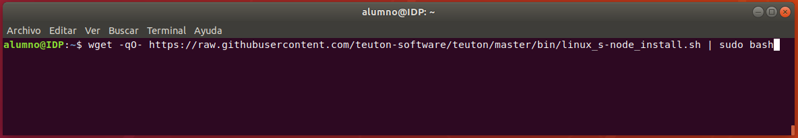

# Configurar una máquina virtual con GNU/Linux como Nodo-S

Para que el profesor en el aula pueda verificar la configuración de tu máquina virtual debes:

1. [Configurarla como Nodo-S](#Configurarla como Nodo-S)
2. [Darle acceso desde la red local del aula](#Dar acceso desde la red local del aula)

## Configurarla como Nodo-S

1. Abrir un terminal (Ctrl + Alt + T).


2. Copia el siguiente comando, pégalo en el terminal y pulsa ENTER.

```bash
wget -qO- https://raw.githubusercontent.com/teuton-software/teuton/master/bin/linux_s-node_install.sh | sudo bash
```

   Quedando del siguiente modo:



3. Una vez ejecutado el comando, si todo va bien, el resultado debería ser similar al siguiente:


Finalizado este apartado, esta máquina virtual ya sería un Nodo-S de Teuton.

## Dar acceso desde la red local del aula

### Configurar la interfaz de red en Adaptador puente

Sigue las instrucciones de este [enlace](../../instalacion/configurar-adaptador-puente-vbox).

### Establecer la configuración de red de la máquina virtual

Debemos establecer la siguiente configuración de red en la máquina virtual:

| Parámetro de red | Valor        |
| ---------------- | ------------ |
| Dirección IP (ip address) | [**10.1.x.y**][1] |
| Máscara de red (netmask) | 255.255.0.0  |
| Puerta de enlace (gateway) | 10.1.0.1     |
| DNS              | 8.8.8.8 |

[1]: Siendo **x** el número asignado por el profesor e **y** un número del 1 y 254.

Cómo establecer la configuración de red en ...

* [Ubuntu 18.04.1 LTS](https://tecadmin.net/change-ip-address-on-ubuntu-18-04-desktop/)