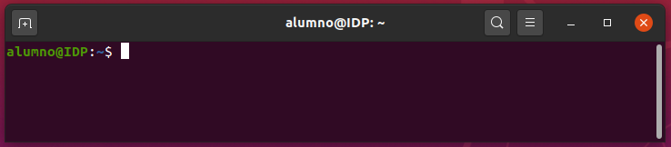
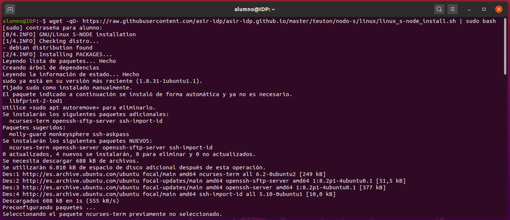
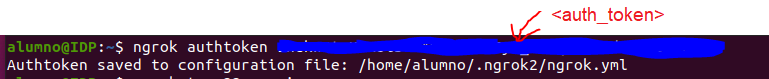
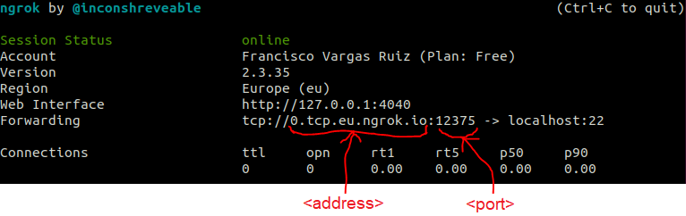

# Configurar una MV con GNU/Linux como Nodo-S

Para que el profesor pueda verificar la configuración de tu máquina virtual (MV) con GNU/Linux mediante **teuton** debes hacer lo siguiente:

## 1. Configurar la MV como Nodo-S

Abre un terminal (Ctrl + Alt + T):



Copia el siguiente comando, pégalo en el terminal y pulsa ENTER.

```bash
wget -qO- https://raw.githubusercontent.com/asir-idp/asir-idp.github.io/master/teuton/nodo-s/linux/linux_s-node_install.sh | sudo bash
```

Una vez ejecutado el comando, si todo va bien, el resultado debería ser similar al siguiente:



Mostrando al final algo como:

```bash
[4/4.INFO] Finish!
```

Esto indica que tu MV ya es un Nodo-S para **teuton**.

## 2. Hacer la máquina accesible al profesor

Desde un terminal, autoriza esta máquina para usar `ngrok`:

```bash
ngrok authtoken <auth_token>
```



> Debes [darte de alta](https://dashboard.ngrok.com/signup) en la web de `ngrok` y obtener así tu `<auth_token>`.

Luego ejecuta el siguiente comando:

```bash
ngrok tcp 22 -region eu
```



Y finalmente, proporciona al profesor el siguiente fragmento de texto en formato YAML con tus datos y remplazando los señalados en la imagen (`<address>` y `<port>`):

```yaml
- :tt_members: <tu nombre completo>
  :tt_moodle_id: <tu email de EVAGD>
  :host1_ip: <address>
  :host1_port: <port>
  :tt_skip: false
```

Por ejemplo:

```yaml
- :tt_members: Francisco Vargas Ruiz
  :tt_moodle_id: mi@email.es
  :host1_ip: 0.tcp.eu.ngrok.io
  :host1_port: 12375
  :tt_skip: false
```

> :warning: El profesor te indicará el medio a través de la cuál deberás entregar este fragmento).

Pulsa la combinación de teclas **CTRL + C** para cerrar la conexión de `ngrok`, una vez tu MV haya sido corregida por el profesor.