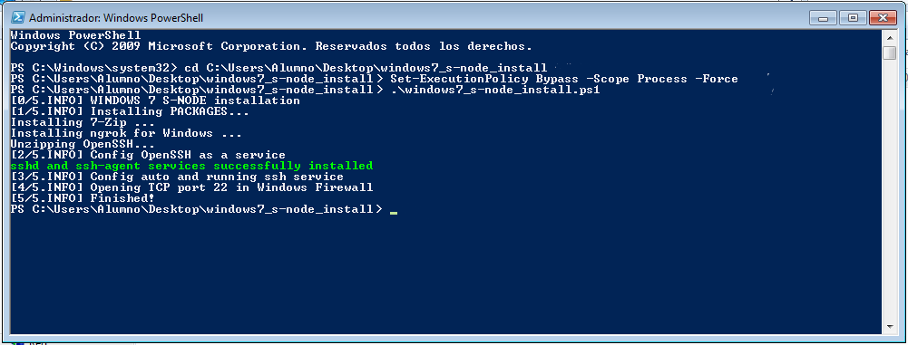

# Configurar una MV con Windows como Nodo-S

Para que el profesor pueda verificar la configuración de tu máquina virtual (MV) con Windows mediante **teuton** debes hacer lo siguiente:

## 1. Configurar la MV como Nodo-S

### Windows 10+

Abre **PowerShell** como `Administrador`.


Copia el siguiente comando, pégalo en el terminal y pulsa ENTER.

```powershell
Set-ExecutionPolicy Bypass -Scope Process -Force; iex ((New-Object System.Net.WebClient).DownloadString('https://raw.githubusercontent.com/asir-idp/asir-idp.github.io/master/teuton/nodo-s/windows/windows_s-node_install.ps1'))
```

Una vez ejecutado el comando, si todo va bien, el resultado debería ser similar al siguiente:


Finalizado este apartado, esta MV ya es un Nodo-S para **teuton**.

### Windows Vista, 7, 8 y 8.1

1. Descargar el fichero ZIP de instalación del Nodo-S para [32 bits](https://github.com/asir-idp/asir-idp.github.io/releases/download/w7-snode-install/windows7_s-node_install_32bits.zip) o [64 bits](https://github.com/asir-idp/asir-idp.github.io/releases/download/w7-snode-install/windows7_s-node_install_64bits.zip).

2. Copiar el fichero ZIP descargado en la MV (a través de una **carpeta compartida en la MV**, por ejemplo).

3. Descomprimir el fichero ZIP en la MV.

4. Abrir **PowerShell** como **Administrador**.

5. Cambiar al directorio que descomprimimos antes: 

    ```powershell
    cd C:\ruta\al\directorio\windows7_s-node_install
    ```

      > Suponiendo que lo hayamos copiado en el Escritorio de nuestro usuario "Alumno":
      >
      > ````powershell
      > cd C:\Users\Alumno\Desktop\windows7_s-node_install
      > ````

6. Habilitar la ejecución de scripts en PowerShell: 

    ```powershell
    Set-ExecutionPolicy Bypass -Scope Process -Force
    ```

7. Ejecutar el script:

    ```powershell
    .\windows7_s-node_install.ps1
    ```

Una vez ejecutado el comando, si todo va bien, el resultado debería ser similar al siguiente:



Finalizado este apartado, esta MV ya es un Nodo-S para **teuton**.

## 2. Hacer la máquina accesible al profesor

En este punto se dan dos posibles situaciones: si tu MV se encuentra:

### a) Dentro del aula

Primero [configuramos la interfaz de red de la MV en **Adaptador puente**](../../../virtualizacion/virtualbox/configurar-red-en-adaptador-puente) para que sea accesible desde la red del aula.

Luego averigua la dirección IP de tu MV de alguno de los siguientes modos:

- Abre un terminal y ejecuta el comando `ipconfig`.

- En la esquina inferior derecha de VBox se encuentra un icono que muestra la actividad de red de la MV, si mantenemos el puntero del ratón sobre dicho icono, nos mostrará la dirección IP:


Y finalmente, proporciona al profesor un fichero en formato YAML con el siguiente contenido, remplazando los valores indicados (`<address>` con la dirección IP de tu MV, y `<usuario>` y `<contraseña>` con las credenciales del usuario de la MV):

```yaml
- :tt_members: <tu nombre completo>
  :tt_moodle_id: <tu email de EVAGD>
  :host1_ip: <address>
  :host1_port: 22
  :host1_username: <usuario>
  :host1_password: <contraseña>  
  :tt_skip: false
```

Por ejemplo:

```yaml
- :tt_members: Francisco Vargas Ruiz
  :tt_moodle_id: mi@email.es
  :host1_ip: 192.168.0.5
  :host1_port: 22
  :host1_username: alumno
  :host1_password: onmula
  :tt_skip: false
```

> Siendo `alumno` el nombre del usuario de la MV y `onmula` su contraseña.

**El profesor te indicará el medio a través del  cuál deberás entregar este fichero.**

### b) En el exterior (en tu casa, p.ej.)

Primero, debes [darte de alta](https://dashboard.ngrok.com/signup) en la web de `ngrok` y obtener así tu `<auth_token>`. 

> Esto sólo tendrás que hacerlo una vez, y podrás reutilizar el token tantas veces como necesites.


Luego, desde un terminal, autoriza esta máquina para usar `ngrok`:

```powershell
ngrok authtoken <auth_token>
```


A continuación, también desde un terminal, ejecuta el siguiente comando:

```powershell
ngrok tcp 22 -region eu
```


Finalmente, **proporciona al profesor un fichero en formato YAML** con el siguiente contenido, remplazando los valores indicados (`<address>` y  `<port>` con los datos que devuelve **ngrok**; y `<usuario>` y `<contraseña>` con las credenciales del usuario de la MV):

```yaml
- :tt_members: <tu nombre completo>
  :tt_moodle_id: <tu email de EVAGD>
  :host1_ip: <address>
  :host1_port: <port>
  :host1_username: <usuario>
  :host1_password: <contraseña>  
  :tt_skip: false
```

Por ejemplo:

```yaml
- :tt_members: Francisco Vargas Ruiz
  :tt_moodle_id: mi@email.es
  :host1_ip: 2.tcp.eu.ngrok.io
  :host1_port: 10746
  :host1_username: alumno
  :host1_password: onmula
  :tt_skip: false
```

> Siendo `alumno` el nombre del usuario de la MV y `onmula` su contraseña.

**El profesor te indicará el medio a través del cuál deberás entregar este fichero.**