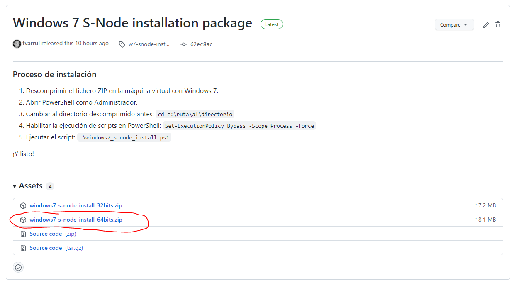
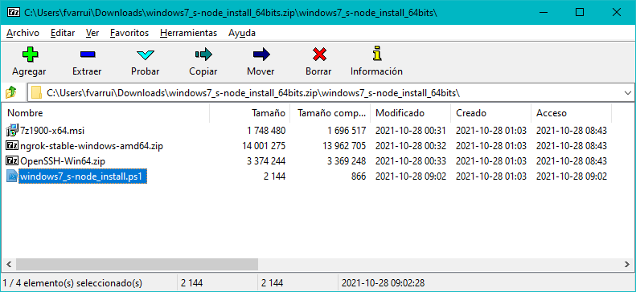
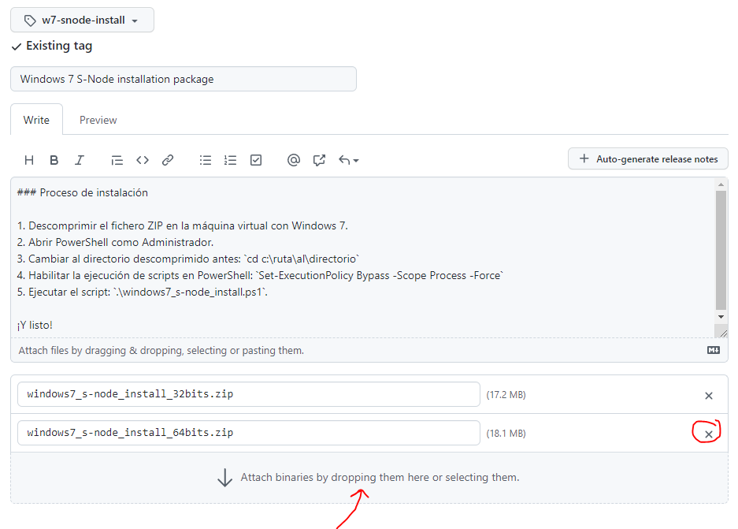

# Cómo preparar el paquete de instalación de Nodo-S para versiones anteriores a Windows 10 de 64 bits

1. Descargar el paquete ZIP del siguiente [enlace](https://github.com/asir-idp/asir-idp.github.io/releases/download/w7-snode-install/windows7_s-node_install_64bits.zip).

	

2. Remplazar el script `windows7_s-node_install.ps1` actualizado dentro el ZIP.

	

3. Volver a subir el ZIP modificado a [**releases**](https://github.com/asir-idp/asir-idp.github.io/releases/tag/w7-snode-install).

	

